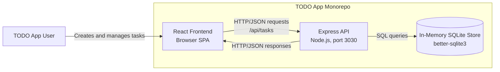
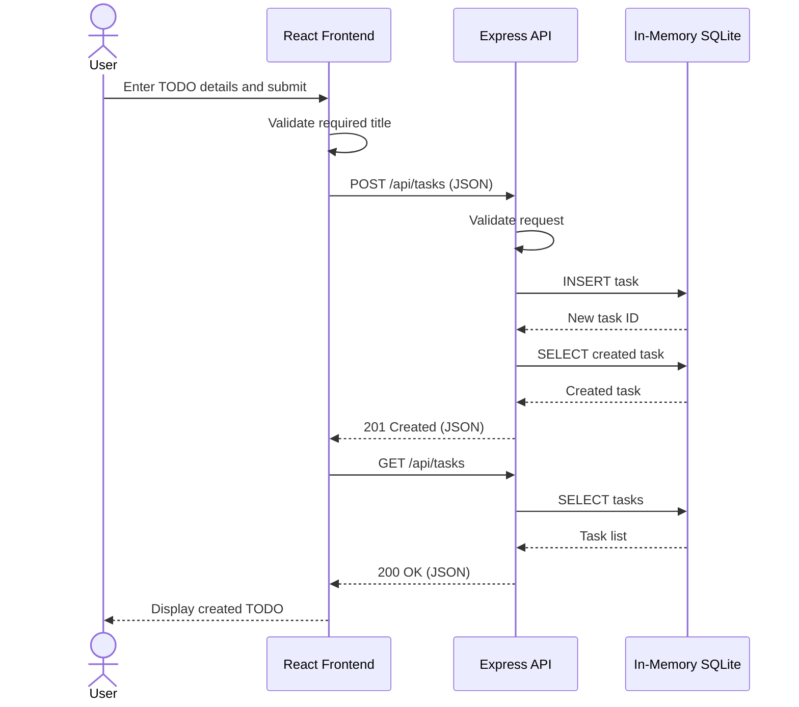

# Cloud Architecture Overview

## System Context

## Creating a TODO Sequence

## Component Responsibilities

- **React frontend:** Renders the task interface and sends task operations to the API. During local development, the frontend proxy forwards `/api` requests to `http://localhost:3030`.
- **Express API:** Exposes task CRUD endpoints under `/api/tasks`, validates requests, and reads from or writes to the task store.
- **In-memory store:** Uses a `better-sqlite3` database created with `:memory:`. Data exists only within the backend process and is lost when that process stops or restarts.

## Deployment Boundary

The repository does not currently define cloud infrastructure or a production deployment topology. The diagram represents the application-level system context and current local runtime architecture.
